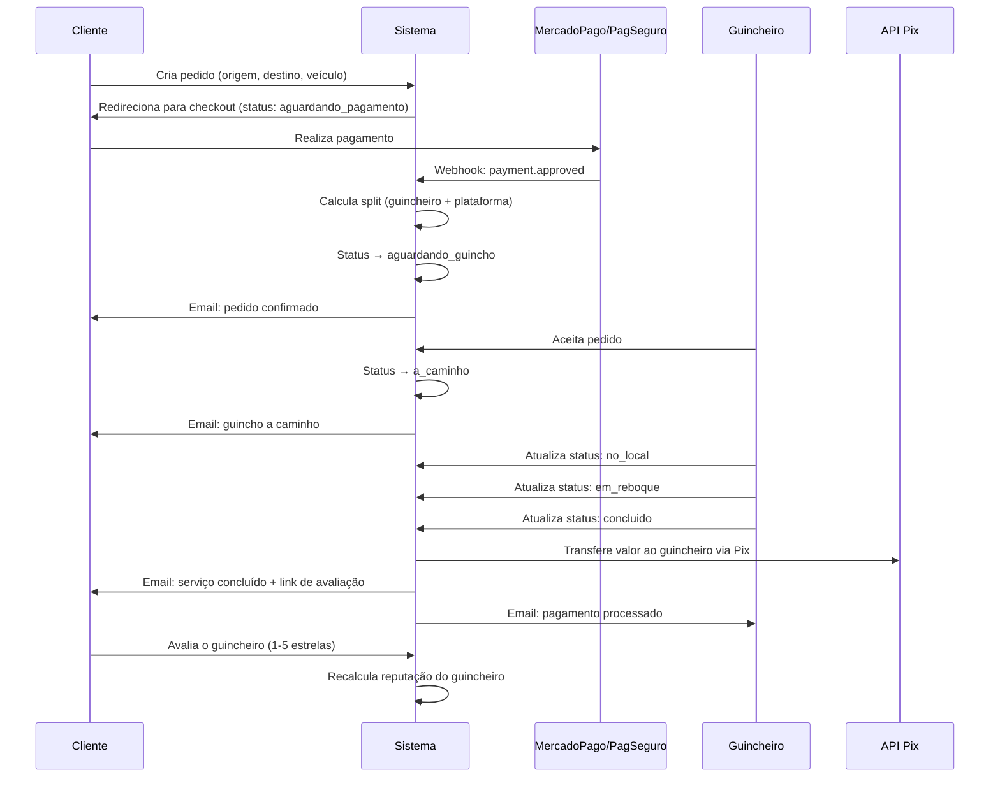
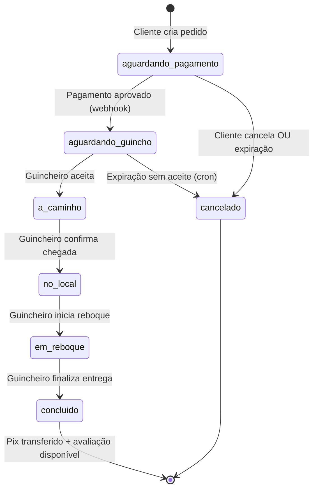

# GuinchaFácil — Constituição do Sistema: Arquitetura, Regras de Negócio e Segurança

# GuinchaFácil — Constituição do Sistema

<user_quoted_section>Este documento é a fonte de verdade para o funcionamento correto, seguro e escalável do GuinchaFácil. Toda implementação deve estar em conformidade com as regras aqui definidas.</user_quoted_section>

## 1. Visão Geral do Sistema

O GuinchaFácil é uma plataforma de intermediação de serviços de guincho/reboque para carros e motos. O sistema conecta **clientes** (quem precisa de socorro) a **guincheiros** (quem presta o serviço), gerenciando o ciclo completo: solicitação → pagamento → atendimento → repasse via Pix.

### Atores do Sistema

| Ator | Responsabilidade |
| --- | --- |
| **Cliente** | Solicita socorro, paga pelo serviço, avalia o guincheiro |
| **Guincheiro** | Aceita pedidos, executa o atendimento, recebe via Pix |
| **Administrador** | Aprova cadastros, monitora operações, configura tarifas |
| **Plataforma** | Intermedia pagamentos, retém comissão, transfere saldo via Pix |

## 2. Fluxo Operacional Completo



## 3. Estados do Pedido e Transições Válidas



### Regras de Transição

- Apenas o **guincheiro atribuído** pode avançar os status `a_caminho → no_local → em_reboque → concluido`
- Apenas o **admin** pode forçar qualquer transição via painel
- O **cliente** pode cancelar apenas nos status `aguardando_pagamento` e `aguardando_guincho`
- Pedidos em `aguardando_guincho` com `expiracao_aceite` vencida devem ser cancelados automaticamente por cron

## 4. Regras de Negócio Financeiras

### 4.1 Cálculo de Custo

```
custo_estimado = taxa_fixa + (distancia_km × tarifa_por_km)
```

- `taxa_fixa` e `tarifa_por_km` são configuráveis pelo admin via tabela `configuracoes`
- O custo é calculado no momento da criação do pedido e **não pode ser alterado após o pagamento**
- `custo_final` pode diferir de `custo_estimado` apenas se o admin ajustar manualmente

### 4.2 Split de Pagamento

```
valor_plataforma = custo_final × comissao_plataforma  (ex: 0.15 = 15%)
valor_guincho    = custo_final - valor_plataforma
```

- A chave `comissao_plataforma` no banco armazena o valor em **decimal** (0.0 a 1.0)
- A chave `comissao_percentual` é **legada** e deve ser removida ou ignorada
- O split é calculado no momento da aprovação do webhook e gravado em `pagamentos`

### 4.3 Repasse via Pix

- O repasse ao guincheiro ocorre **somente após o status ****`concluido`**
- A transferência usa a `chave_pix` e `chave_pix_tipo` cadastradas no perfil do guincheiro
- O sistema deve registrar o `id_transacao_pix` retornado pela API e marcar `pago_guincho = 1`
- Em caso de falha no Pix, o admin deve ser notificado e o pagamento entra em fila de reprocessamento

### 4.4 Estorno

- Pedidos cancelados em `aguardando_pagamento` ou `aguardando_guincho` devem ter o pagamento estornado via API do gateway
- Pedidos cancelados após `a_caminho` não têm estorno automático — requer análise manual do admin

## 5. Regras de Segurança

### 5.1 Autenticação e Sessão

- Sessão regenerada a cada 5 minutos (já implementado no `index.php`)
- Sessão expira após **60 minutos de inatividade** — verificação deve ser consistente entre `AuthController` e `AuthService`
- CSRF token obrigatório em todos os formulários POST — token único por sessão (não por requisição)
- Rate limiting: máximo **5 tentativas de login** por IP em janela de 5 minutos

### 5.2 Webhooks

- Webhook do MercadoPago: validação obrigatória via HMAC-SHA256 com `MP_WEBHOOK_SECRET`
- Webhook do PagSeguro: validação via consulta à API (não confiar apenas no payload recebido)
- Todos os webhooks devem ser idempotentes — reprocessar o mesmo evento não deve duplicar pagamentos
- Logs de todos os webhooks recebidos na tabela `logs_webhook`

### 5.3 Uploads

- Validação de MIME type real via `finfo` (não apenas extensão)
- Tamanho máximo: 5MB por arquivo
- Tipos permitidos: `image/jpeg`, `image/png`, `application/pdf`
- Arquivos salvos fora do webroot com nome gerado aleatoriamente
- Nunca servir uploads diretamente — usar controller intermediário com verificação de permissão

### 5.4 Dados Sensíveis

- Credenciais de banco, tokens de API e chaves de criptografia devem estar em variáveis de ambiente (`.env`) ou arquivo fora do webroot — **nunca no repositório**
- Chave Pix dos guincheiros deve ser criptografada em repouso no banco
- Logs não devem conter dados pessoais (CPF, chave Pix, senha)

## 6. Regras de Cadastro de Guincheiro

| Campo | Validação |
| --- | --- |
| CNH | Número com 9+ dígitos, validade futura obrigatória |
| Placa | Formato Mercosul (7 chars alfanuméricos) ou antigo |
| Capacidade | > 0 e ≤ 100 toneladas |
| Chave Pix | Validada conforme tipo (CPF, email, telefone, aleatória) |
| Documentos | CNH frente e verso obrigatórios (JPEG/PNG/PDF, ≤ 5MB) |
| Aprovação | Guincheiro só pode aceitar pedidos após aprovação manual do admin |

## 7. Regras de Geolocalização

- Coordenadas de origem e destino são **obrigatórias** — pedido não pode ser criado com lat/lng zerados
- Validação de coordenadas dentro dos limites do Brasil: lat [-34, 5], lng [-74, -28]
- Distância calculada via fórmula de Haversine (já implementada em `GeoService` e `config.php`)
- Raio de busca de guincheiros: começa em `raio_inicial_km` e expande até `raio_maximo_km` conforme configuração

## 8. Configurações do Sistema (tabela `configuracoes`)

| Chave | Tipo | Descrição |
| --- | --- | --- |
| `tarifa_por_km` | decimal | Valor por km (R$) |
| `taxa_fixa` | decimal | Taxa fixa de acionamento (R$) |
| `comissao_plataforma` | decimal (0-1) | Comissão da plataforma |
| `tempo_expiracao_min` | inteiro | Minutos para expirar aceite |
| `raio_inicial_km` | inteiro | Raio inicial de busca |
| `raio_maximo_km` | inteiro | Raio máximo de busca |

<user_quoted_section>Regra: A chave comissao_percentual é legada e deve ser removida. Usar apenas comissao_plataforma em formato decimal.</user_quoted_section>

## 9. Notificações

- Todas as notificações de email devem usar **PHPMailer com SMTP** configurado — `mail()` nativo é proibido em produção
- Eventos que geram notificação:
  - Pagamento confirmado → cliente
  - Guincho aceito → cliente
  - Serviço concluído → cliente (com link de avaliação) + guincheiro (com valor a receber)
  - Cadastro aprovado → guincheiro
  - Novo pedido disponível → guincheiros na área (opcional, por email)
  - Falha no Pix → admin

## 10. Auditoria e Logs

- Tabela `app_logs` deve ser criada no schema para logs estruturados da aplicação
- Tabela `logs_webhook` já existe — manter e expandir
- Logs devem conter: timestamp, nível (INFO/WARN/ERROR), contexto, mensagem, dados relevantes (sem PII)
- Admin deve ter acesso ao painel de logs com filtros por data, nível e fonte
- Retenção de logs: 90 dias para logs de aplicação, 1 ano para logs financeiros

## 11. Escalabilidade e Operação

- O sistema deve suportar múltiplos guinchos simultâneos sem race condition no aceite de pedidos (usar `SELECT ... FOR UPDATE` ou transação atômica)
- Cron jobs necessários:
  - A cada 1 minuto: cancelar pedidos com `expiracao_aceite` vencida
  - A cada 5 minutos: reprocessar transferências Pix com falha
  - Diário: limpeza de tokens de reset de senha expirados
- Índices de banco já definidos no schema — manter e não remover