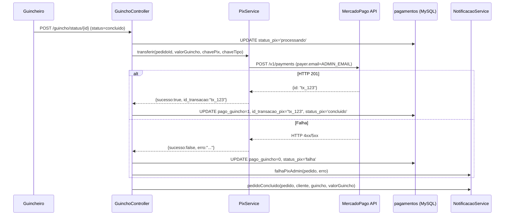

I have created the following plan after thorough exploration and analysis of the codebase. Follow the below plan verbatim. Trust the files and references. Do not re-verify what's written in the plan. Explore only when absolutely necessary. First implement all the proposed file changes and then I'll review all the changes together at the end.

## Observações sobre o Código Atual

Após análise completa, **a maior parte do ticket já foi implementada**: `PixService.php` (ambos os métodos), a integração em `GuinchoController::atualizarStatus()`, o método `AdminController::pixReprocessar()`, a rota dinâmica em `index.php`, as colunas Pix em `migration_fix.sql` (FIX 7), e o card de reprocessamento em `pedidodetalhe.php` — tudo já existe e está correto.

**Há um único bug real pendente:** em `PixService::transferir()`, o campo `payer.email` usa a constante `PS_EMAIL` (credencial do PagSeguro), quando deveria usar o email do admin da plataforma.

## Abordagem

Corrigir apenas o bug identificado: substituir `PS_EMAIL` pela constante `ADMIN_EMAIL`, que já está definida em `config.php` com fallback para `SMTP_FROM_EMAIL`. Isso é idiomático ao projeto (sem DB query desnecessária, sem nova dependência) e alinha com a §4.3 da spec.

---

## Implementação

### 1. Corrigir o email do pagador em `src/Services/PixService.php`

No método `transferir()`, dentro do array `$body`, a chave `payer.email` está usando `PS_EMAIL` (constante do PagSeguro). Substitua pelo email correto da plataforma:

- Troque `defined('PS_EMAIL') ? PS_EMAIL : ''` por `defined('ADMIN_EMAIL') ? ADMIN_EMAIL : (defined('SMTP_FROM_EMAIL') ? SMTP_FROM_EMAIL : '')`

A constante `ADMIN_EMAIL` já é definida em `file:config.php` na linha 39 como `env('ADMIN_EMAIL', env('SMTP_FROM_EMAIL'))`, portanto sempre terá um valor válido quando o `.env` estiver configurado.

> **Isso é a única alteração necessária.** Todos os outros itens do ticket (migration SQL, PixService::reprocessar, GuinchoController, AdminController::pixReprocessar, rota dinâmica, view pedidodetalhe, NotificacaoService) já estão implementados corretamente.

---

## Verificação do Fluxo Completo

### Reprocessamento Manual (Admin)

O fluxo de reprocessamento via painel já está completo:

| Componente | Status |
|---|---|
| `migration_fix.sql` FIX 7 — colunas `id_transacao_pix` e `status_pix` | ✅ Implementado |
| `PixService::transferir()` — chamada à API MP | ✅ Implementado (corrigir email) |
| `PixService::reprocessar()` — busca falha e retenta | ✅ Implementado |
| `GuinchoController::atualizarStatus()` — integração Pix | ✅ Implementado |
| `AdminController::pixReprocessar()` — endpoint admin | ✅ Implementado |
| Rota `POST /admin/pix/reprocessar/` em `index.php` | ✅ Implementado |
| Card de alerta + botão em `pedidodetalhe.php` | ✅ Implementado |
| `NotificacaoService::pedidoConcluido()` — usa `$valorGuincheiro` real | ✅ Implementado |
| `PixService::transferir()` — `payer.email` correto | ❌ **Pendente** |