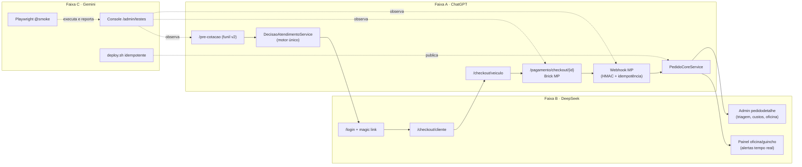

# ARQUITETURA — GuinchaFácil

> Fonte de verdade de estrutura. Todo agente lê este arquivo antes de agir e **não explora o resto do repositório** (R4).
> Última atualização: 2026-09-30. Itens marcados **não verificado** ainda precisam de confirmação com o trecho real do código.

## 1. Visão geral

| Item | Valor |
| --- | --- |
| Linguagem | PHP 8 |
| Arquitetura | MVC próprio (`Controllers`, `Models`, `Services`, `Views`) |
| Banco | MySQL/MariaDB |
| Ambiente local | XAMPP (Windows) |
| Produção | cPanel + LiteSpeed (`guinchafacil.com.br`) |
| Pagamento | Mercado Pago (Brick) + webhook |
| Dono do projeto | Humano: revisa, aprova contratos, edita arquivos compartilhados e faz o merge |

> **Atenção à pasta de docs:** o protocolo v2 verificou que a pasta real do repositório é `doc/` (já bloqueada no `.htaccess`), enquanto este pacote usa `docs/`. Ver `DECISOES.md` (D3).

## 2. Mapa do código (estado atual) e faixa dona

Legenda: **[A]** Motor + Checkout + Pagamento · **[B]** Cadastro/Auth + Painéis · **[C]** QA + Console + Deploy · **[?]** sem faixa definida no protocolo.

```
src/
├── Controllers/
│   ├── AuthController.php          [B]  Google, login, magic link, preCotacao
│   ├── CheckoutController.php      [A]  5 métodos (cliente, veículo, pagar)   ⚠ ver §6.1
│   ├── PagamentoController.php     [A]  Brick MP, webhook
│   └── PreCotacaoApiController.php [A]  APIs do funil v2
├── Models/
│   ├── Pedido.php                  [A]  criarCompleto
│   ├── Veiculo.php                 [A]  criar
│   ├── Pagamento.php               [A]  criar
│   └── Configuracao.php            [?]  get / set
├── Services/
│   ├── Auth/MagicLinkService.php              [B]
│   ├── Payment/MercadoPagoProvider.php        [A]
│   ├── Address/{Photon,Nominatim}AddressProvider.php   [?]
│   ├── PreCotacao/PreCotacaoOpcoesService.php [?]
│   └── CoberturaService.php                   [?]
├── Views/
│   ├── auth/login.php              [B]  reescrito
│   ├── public/checkout-cliente.php [B]
│   ├── public/checkout-veiculo.php [A]
│   └── pagamento/checkout.php      [A]  Brick MP (existente)
└── public/assets/js/
    ├── public-pre-cotacao-flow.js  [A]  funil v2 (existente)
    └── checkout-veiculo.js         [A]  cascata + toggle
```

Arquivos **[?]** não estão listados em nenhuma faixa em `lanes.json`. Até decisão do dono, nenhum agente os altera: quem precisar emite `CONTRATO_PEDIDO` ou `ROTA_PEDIDA` (ver `CONTRATOS.md`).

## 3. Faixas

| Faixa | Dono | Escopo | Quem testa |
| --- | --- | --- | --- |
| **A** | ChatGPT | Motor de decisão, pré-cotação, checkout do veículo, pagamento, webhook | Gemini (E2E + contrato) |
| **B** | DeepSeek | Login/magic link, checkout do cliente, painéis cliente/oficina/guincho, admin (lista e detalhe de pedido) | ChatGPT (testes PHP de contrato) |
| **C** | Gemini | Testes, console `/admin/testes`, deploy e infraestrutura | DeepSeek (deploy 2x + teste de mutação) |

A lista exata de arquivos de cada faixa está em `docs/lanes.json` (usada por `tools/lane_guard.ps1`). O estado de cada faixa fica em `docs/lanes/<FAIXA>.md`.

### Rotas por faixa

| Faixa | Rotas |
| --- | --- |
| A | `/pre-cotacao*`, `/checkout/veiculo`, `/checkout/pagar`, `/pagamento/checkout/{id}`, `/pagamento/mercadopago/pagar`, `/webhook/mercadopago` |
| B | `/login`, `/auth/magic/{token}`, `/checkout/cliente`, `/cliente/*`, `/oficina/*`, `/guincho/*`, `/admin/pedidos`, `/admin/pedido/{id}` |
| C | `/admin/testes*` |

### Arquivos compartilhados (só o dono edita ou aprova)

`index.php` (rotas), `config.php`, `docs/CONTRATOS.md`, `docs/lanes.json`.
Rota nova: o agente emite um bloco `ROTA_PEDIDA:` e o dono cola no `index.php` (evita conflito no arquivo que já teve 24 duplicatas).

## 4. Fluxo de funcionamento



**Fluxo de trabalho diário**

```
XAMPP → branch lane/<faixa> → tools/lane_guard.ps1 → tools/smoke.ps1 (verde?)
      → commit → push → dono revisa → merge main → tag ok-AAAAMMDD-N
      → cPanel: bash tools/deploy.sh → smoke remoto → (falhou? git reset --hard <última tag ok>)
```

## 5. Idempotência: o que cada peça deve garantir

| Item | Regra |
| --- | --- |
| Migrations | `INFORMATION_SCHEMA` + SQL dinâmico. Rodar 2x não altera nada. Usar o `install/migrate.php` existente (tabela `schema_migrations`). |
| Seeds (marcas/modelos) | `INSERT ... ON DUPLICATE KEY UPDATE` com chave única (marca, modelo). |
| Pagamento | `X-Idempotency-Key = "ped{id}-t{tentativa}"`. Reenviar o mesmo POST não cobra duas vezes. |
| Webhook | Índice único `(provedor, event_id)` em `logs_webhook`. Evento repetido retorna 200 sem reprocessar. |
| Criar pedido | Um pedido por `triage_session_id`. Duplo clique não duplica. |
| Dados de teste | Prefixo `E2E_` / `@teste.local`. Script de limpeza seguro para rodar N vezes. |
| `deploy.sh` | Pode rodar 2x seguidas: mesmo resultado, sem erro. |

## 6. Fatos verificados no repositório real

Conferidos no zip enviado (protocolo v2, seção 8):

- `admin/pedidodetalhe.php` tem **0** menções a oficina/decisão/triagem (gap do admin confirmado).
- `oficina/dashboard.php` **não** inclui `communications.css/js`, `atendimento-status.js`, `offline-queue.js`; o `guincho/dashboard.php` inclui.
- `sidebar_oficina.php` está correto (só `/logout` fora de `/oficina`). A suspeita anterior era falsa.
- `PricingService`, `TarifaService` e `EspecialistaPricingService` coexistem (motor duplicado).
- O "404 em todas as rotas" foi falso alarme: `curl -sI` envia HEAD e o router do `index.php` só trata GET/POST.
- Infra de teste grande já existe: `qa/` (Playwright TS, ~50 suites, `RELATORIO-QA-FINAL.md`), `tests/e2e`, `tests/Unit`, `tests/Integration` (inclui `PaymentWebhookIdempotencyTest` e `DecisaoAtendimentoTest`) e rotas admin `/admin/qa/run/*`. Há dois `playwright.config` (raiz e `qa/`).
- `install/migrate.php` idempotente já existe.
- 148 arquivos `.bak*` dentro de `src/` e `public/` (8 só do `DecisaoAtendimentoService`).
- Só 3 branches e nenhuma tag.

### 6.1 Pontos de atenção de fronteira entre faixas

- `CheckoutController` é da faixa **A**, mas o método `cliente` serve a rota `/checkout/cliente` e a view `checkout-cliente.php`, que são da faixa **B**. Enquanto não houver decisão (ver `DECISOES.md`, D9), alteração nesse método passa por `CONTRATO_PEDIDO` à faixa A.
- `AuthController` (faixa B) contém o tratamento de `preCotacao`, que pertence ao funil da faixa A. Mudanças de comportamento aí seguem o mesmo caminho.

## 7. Riscos conhecidos

| Risco | Situação |
| --- | --- |
| .cpanel.yml copia tudo (inclui `tests`, `qa`, `.bak`), não remove arquivos deletados, e executa proteção ao `.env` de produção (faz backup antes, restaura depois do deploy). | O deploy via cPanel Git é seguro para o `.env`. |
| Segredos expostos em texto puro em conversas anteriores (chaves do Mercado Pago, tokens, senha de contas de teste em produção). | Rotacionar no painel do Mercado Pago; desativar contas `cliente1..3@teste.local` em produção. |
| `.env` real, `node_modules` (~96 MB) e `.git` foram enviados a IAs. | Enviar apenas `git archive` ou zip filtrado. |
| Arquivos soltos na raiz: `_auditoria_export.txt`, `deepKS.txt`, `result.json`, `gemini.js`, `index.php.bak-stage3-*`. | Mover para `_archive/` com autorização do dono (R6). |

## 8. Segurança (vale para todos os agentes)

- Nunca imprimir segredos (`.env`, tokens, senhas). Mascarar com `***`.
- Para inspecionar variáveis do MP: `grep -E "^MP_" .env | sed 's/=.*/=***/'`.
- O console de testes bloqueia se `MP_ENV != sandbox` e só manipula dados `E2E_`.
